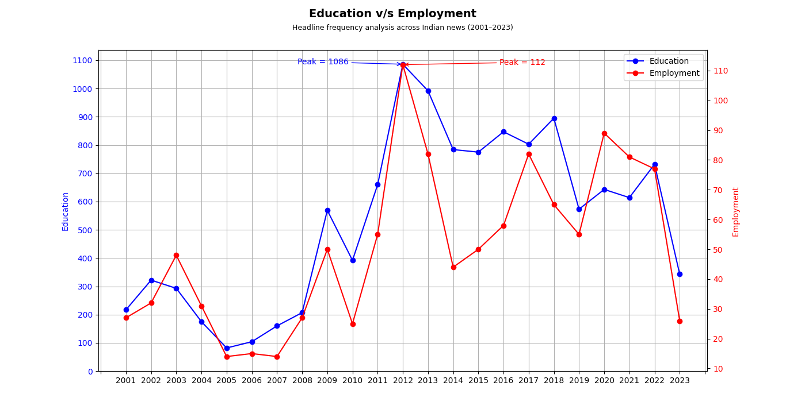

# india-unfiltered

> Analyzing 3.8 million real Indian news headlines to uncover patterns, trends, and the words that defined a nation.

---

## What is this?

**india-unfiltered** is a data analysis project that digs into 22 years of Indian news coverage — from 2001 to 2023 — to answer a simple but revealing question:

*What does the Indian media actually talk about, and how has that changed over time?*

This project uses a dataset of **3,876,557 headlines** sourced from Kaggle, analyzed using Python, Pandas, and Matplotlib.

---

## Findings

### Education vs Employment Coverage (2001–2023)



- **Education** peaked in **2012 with 1,086 headlines** — coinciding with widespread national debate around the Right to Education (RTE) Act implementation.
- **Employment** never crossed **112 headlines** in any single year across 22 years — despite unemployment being one of India's most pressing issues.
- Both keywords follow near-identical trend patterns year over year, suggesting that **overall news volume** drives individual topic coverage more than editorial priority.
- The **2018–2020 divergence** is the most interesting anomaly — education coverage spiked while employment didn't follow. Make of that what you will.

---

## Dataset

- **Source:** [India News Headlines — Kaggle](https://www.kaggle.com/datasets/therohk/india-headlines-news-dataset)
- **Size:** 3,876,557 headlines
- **Columns:** `publish_date`, `headline_category`, `headline_text`
- **Period:** January 2001 — December 2023
- **Null values:** None

> The CSV is not included in this repo due to file size. Download it directly from Kaggle and place it in the project root as `india-news-headlines.csv`.

---

## How to Run

**1. Clone the repo**
```bash
git clone https://github.com/NAV-ON-WINDOWS/india-unfiltered.git
cd india-unfiltered
```

**2. Install dependencies**
```bash
pip install pandas matplotlib numpy
```

**3. Download the dataset**

Download `india-news-headlines.csv` from [Kaggle](https://www.kaggle.com/datasets/therohk/india-headlines-news-dataset) and place it in the project root.

**4. Run the script**
```bash
python main.py
```

---

## What I Learned

This was my first real data analysis project — built while learning Pandas from scratch.

Concepts used:
- Reading and validating large CSV files with Pandas
- Boolean indexing and conditional filtering (`str.contains`)
- Extracting and grouping time-series data (`value_counts`, `groupby`)
- Dual-axis plotting with Matplotlib
- Data annotation and visualization best practices

---

## Tech Stack

| Tool | Purpose |
|------|---------|
| Python 3.14 | Core language |
| Pandas | Data loading, filtering, analysis |
| Matplotlib | Visualization |
| NumPy | Numerical support |

---

## Project Structure

```
india-unfiltered/
├── main.py               # Main analysis script
├── README.md             # You are here
└── .gitignore            # Excludes .venv and CSV
```

---

## Author

Built by [Arnav](https://github.com/NAV-ON-WINDOWS) — CS fresher, first data project.  
If you found this interesting, star the repo.
